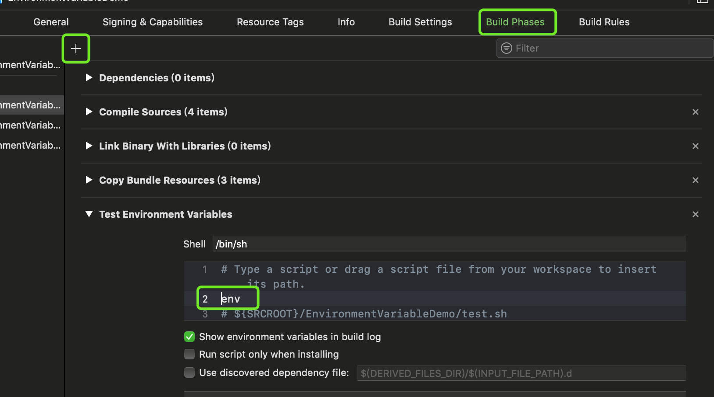

# XcodeEnvVariableDemo

在`Build Phases`页面，点击左上角`+` ，选择`New Run Script Phase`，添加一个编译脚本，在脚本中添加 `env`，然后编译，就可以打印出Xcode全部的环境变量了。

> 关于环境变量的具体描述，请参考[苹果官方文档](https://help.apple.com/xcode/mac/10.2/#/itcaec37c2a6)
